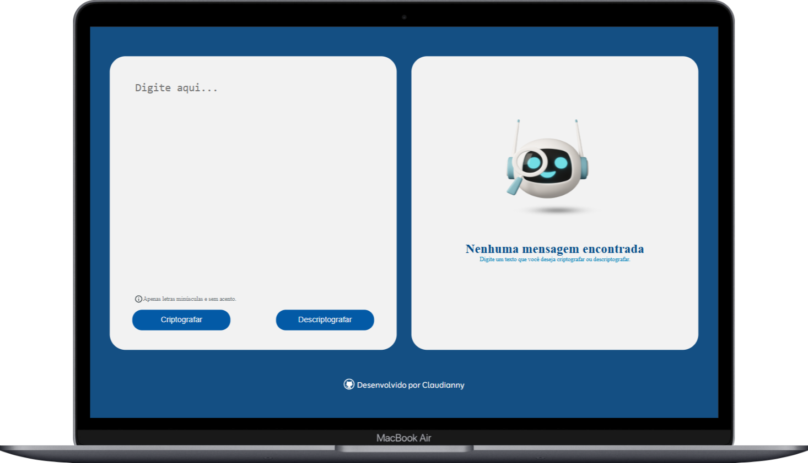

# Decodificador de Texto 🔐

## 📜 **Descrição**  
Este projeto é um decodificador de texto simples e funcional, onde o usuário pode criptografar e descriptografar palavras de maneira fácil. Usando um conjunto de chaves específicas para cada letra, o programa converte letras do alfabeto em sequências codificadas e também reverte o processo para restaurar o texto original.

A ideia é permitir a conversão de palavras para uma versão criptografada, assim como retornar de uma versão criptografada para o texto original. Tudo isso em uma interface simples e acessível.

## 🎨 **Layout**  
O layout da página foi projetado para ser direto e intuitivo. Possui um campo de inserção de texto para criptografar ou descriptografar palavras, permitindo que o usuário escolha facilmente entre as opções. A página é responsiva e adapta-se bem a diferentes dispositivos, garantindo uma boa experiência tanto em desktops quanto em celulares.



## 🛠️ **Tecnologias Utilizadas**  
Neste projeto, utilizei as seguintes tecnologias para garantir uma boa experiência de interação:

- **HTML**: Estrutura principal da página.
- **CSS**: Estilização da interface, deixando a página visualmente agradável e funcional.
- **JavaScript**: Lógica de criptografia e descriptografia, além do controle das interações do usuário.
  
##⚙️ **Funcionalidades**

- **Criptografia**: Converte uma palavra normal para sua versão criptografada com as seguintes chaves:
  - "e" → "enter"
  - "i" → "imes"
  - "a" → "ai"
  - "o" → "ober"
  - "u" → "ufat"
  
- **Descriptografia**: Reverte uma palavra criptografada para sua forma original.

- **Campo de Entrada**: O usuário pode inserir o texto a ser criptografado ou descriptografado.

- **Escolha de Ação**: O usuário pode escolher entre criptografar ou descriptografar o texto inserido.

- **Copiar para Área de Transferência**: Um botão que permite copiar o texto criptografado ou descriptografado diretamente para a área de transferência, facilitando o compartilhamento ou uso do texto sem a necessidade de copiar manualmente.

## 📱 **Como Usar**

1. Acesse o site: [Decodificador de Texto](https://decodificador-snowy-five.vercel.app)

2. Insira uma palavra no campo de texto.

3. Escolha se deseja criptografar ou descriptografar o texto.

4. O resultado será exibido automaticamente na tela.

5. Se desejar, clique no botão "Copiar" para copiar o texto gerado para a área de transferência.

## Para Clonar o Repositório
Se preferir rodar o projeto localmente, siga estas etapas:

1. Clone o repositório em sua máquina local:

   ```bash
   git clone https://github.com/Claudiannyy/Decodificador-texto.git
   ```
2. Navegue até a pasta do projeto:
3. Abra o arquivo index.html no seu navegador para visualizar o projeto.


## 🔧 **Personalização** 

- **Alterar as chaves de criptografia**: Caso queira modificar as regras de codificação, edite as substituições dentro do código JavaScript.
- **Ajustar o design**: Modifique os estilos no arquivo `style.css` para alterar a aparência da página.
- **Adicionar/Remover validação de entrada**: Caso queira melhorar a usabilidade, você pode adicionar ou excluir validações para garantir que o usuário insira apenas letras minúsculas, sem acentos ou caracteres especiais ou que não terá diferença.
